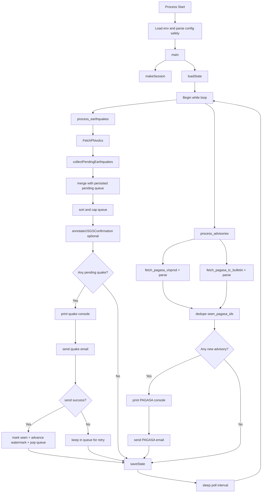

# Program Flow Presentation

## Slide 1 - System Purpose
- Monitor earthquake and weather sources continuously.
- Filter for Cebu-relevant risk conditions.
- Send email alerts and avoid duplicate/redundant sends.
- Persist state so restart behavior is controlled.

## Slide 2 - High-Level Runtime Loop
1. Start app and load environment configuration.
2. Build HTTP session with retries.
3. Load state file for seen IDs, pending queue, and watermarks.
4. Loop every poll interval:
   - Pull and filter earthquakes.
   - Merge with pending queue and cap queue size.
   - Add optional USGS confirmation metadata.
   - Pull and filter PAGASA advisories.
   - Send alerts.
   - Save updated state.

## Slide 3 - Startup Functions (Call Order)
1. `load_dotenv()`
2. `envBool()`, `envInt()`, `envFloat()` for safe config parsing
3. `main()`
4. `makeSession()`
5. `loadState()`
6. Initialize local in-memory trackers:
   - `seen_quakes`
   - `pending_quake_events`
   - `seen_pagasa`
   - `last_alerted_dt`

## Slide 3A - Screenshot Code Anchors (Startup)
- Safe env parsing helpers:
   - [envBool](AlertSystem.py#L30)
   - [envInt](AlertSystem.py#L45)
   - [envFloat](AlertSystem.py#L62)
- Runtime config bindings:
   - [poll and refresh settings](AlertSystem.py#L79)
   - [USGS + queue settings](AlertSystem.py#L90)
- Main entry and bootstrap:
   - [main function start](AlertSystem.py#L253)
   - [makeSession call context](AlertSystem.py#L254)
   - [loadState call context](AlertSystem.py#L255)
- Session and state implementations:
   - [makeSession](AlertSystem.py#L111)
   - [loadState](AlertSystem.py#L131)

## Slide 4 - Earthquake Pipeline (Detailed)
1. `process_earthquakes()` in PHIVOLCS module
2. `FetchPhivolcs()` fetches events from local PHIVOLCS API
3. `collectPendingEarthquakes()` filters each event by:
   - `isNew()` vs `last_alerted_dt`
   - `withinMaxAge()` vs `MAX_EVENT_AGE_MIN`
   - `meetsAlertCriteria()`
4. `meetsAlertCriteria()` checks:
   - `isCebuEarthquake()`
   - magnitude `> MIN_CEBU_ALERT_MAGNITUDE`
5. Main loop merges new pending with persisted pending.
6. Queue sorted by `quakeSortKey()` and capped by `MAX_PENDING_QUAKE_EVENTS`.

## Slide 4A - Screenshot Code Anchors (Earthquake)
- Threshold and criteria:
   - [MIN_CEBU_ALERT_MAGNITUDE](PHIVOLCS/parser.py#L23)
   - [meetsAlertCriteria](PHIVOLCS/parser.py#L180)
- PHIVOLCS fetch and pending collection:
   - [FetchPhivolcs](PHIVOLCS/parser.py#L188)
   - [collectPendingEarthquakes](PHIVOLCS/parser.py#L561)
   - [process_earthquakes](PHIVOLCS/parser.py#L582)
- Main loop integration:
   - [call to process_earthquakes](AlertSystem.py#L304)
   - [pending queue merge block](AlertSystem.py#L318)
   - [queue sort + cap](AlertSystem.py#L340)

## Slide 5 - USGS Confirmation Pipeline (Optional)
1. `annotateUSGSConfirmation()`
2. `FetchUSGSEarthquakes()` (with short cache)
3. `findUSGSMatch()` compares by:
   - time delta window
   - distance threshold
   - magnitude tolerance
4. Matched events receive:
   - `usgs_confirmed = True`
   - `usgs_match_summary`
5. These fields are displayed in console/email but not persisted in state.

## Slide 5A - Screenshot Code Anchors (USGS)
- USGS source config:
   - [USGS_API_URL and cache TTL](PHIVOLCS/parser.py#L24)
- USGS fetch/match/annotate:
   - [FetchUSGSEarthquakes](PHIVOLCS/parser.py#L241)
   - [findUSGSMatch](PHIVOLCS/parser.py#L341)
   - [annotateUSGSConfirmation](PHIVOLCS/parser.py#L393)
- Main loop annotation call:
   - [annotateUSGSConfirmation in loop](AlertSystem.py#L344)

## Slide 6 - PAGASA Advisory Pipeline
1. `process_advisories()` in PAGASA module
2. `fetch_pagasa_visprsd()` for PRSD content
3. `parse_visprsd_cebu_advisories()` extracts Cebu advisories:
   - Heavy Rainfall Warning (section-scoped, no-warning phrases blocked)
   - Thunderstorm Warning/Advisory
   - Tropical Cyclone Alert from PRSD when criteria match
4. `fetch_pagasa_tc_bulletin()` + `parse_tc_bulletin_cebu_alerts()` for TC bulletin source
5. Deduplicate using advisory key + `seen_pagasa_ids`

## Slide 6A - Screenshot Code Anchors (PAGASA)
- HRW false-positive protection:
   - [extractSection](PAGASA/parser.py#L44)
   - [hasNoHeavyRainfallWarning](PAGASA/parser.py#L57)
   - [parse_visprsd_cebu_advisories](PAGASA/parser.py#L206)
- TC bulletin and status helpers:
   - [parse_tc_bulletin_cebu_alerts](PAGASA/parser.py#L272)
   - [ExtractHRWStatus](PAGASA/parser.py#L310)
- Main advisory flow:
   - [process_advisories](PAGASA/parser.py#L481)
   - [call to process_advisories in main loop](AlertSystem.py#L352)

## Slide 7 - Output and Send Logic
1. If pending quakes exist:
   - Print `formatEarthquakeConsole()`
   - Send `formatEarthquakeEmail()` via `sendAlertEmail()`
   - On success: mark quake as seen and update `last_alerted_dt`
   - On failure: keep quake in queue for retry next cycle
2. If PAGASA advisories exist:
   - Print `formatPagasaConsole()`
   - Send `formatPagasaEmail()` via `sendAlertEmail()`

## Slide 7A - Screenshot Code Anchors (Output)
- Email sender path:
   - [sendEmail](AlertSystem.py#L177)
   - [sendAlertEmail](AlertSystem.py#L220)
- Earthquake output formatters:
   - [formatEarthquakeConsole](PHIVOLCS/parser.py#L515)
   - [formatEarthquakeEmail](PHIVOLCS/parser.py#L439)
- Weather output formatters:
   - [formatPagasaConsole](PAGASA/parser.py#L445)
   - [formatPagasaEmail](PAGASA/parser.py#L334)
- Send/retry control in loop:
   - [pending quake send loop](AlertSystem.py#L365)
   - [email failure retry behavior](AlertSystem.py#L373)

## Slide 8 - State and Restart Behavior
State file stores:
- `seen_quake_ids`
- `pending_quake_events`
- `seen_pagasa_ids`
- `last_alerted_dt_iso`
- refresh counters/markers

Impact:
- Prevents duplicate alerts for already sent events.
- Retains unsent quake queue across restart.
- Supports controlled cold-start behavior with `COLD_START_SUPPRESS`.

## Slide 8A - Screenshot Code Anchors (State)
- State shape and defaults:
   - [loadState defaults](AlertSystem.py#L137)
- Queue persistence sanitation:
   - [serializeQuakeForState](AlertSystem.py#L172)
- Save points each cycle:
   - [saveState write block in loop](AlertSystem.py#L400)

## Slide 9 - Reliability Controls
- Safe env parsing prevents startup crash on malformed config.
- HTTP retry adapter for resilient fetches.
- USGS confirmation is non-blocking.
- Quake send is at-least-once style for pending items until success.
- PAGASA heavy-rain false-positive guard in parser.

## Slide 10 - End-to-End Flow Diagram

## Slide 11 - Key Config Knobs for Ops
- `POLL_INTERVAL_SEC`
- `MAX_PENDING_QUAKE_EVENTS`
- `MAX_EVENT_AGE_MIN`
- `COLD_START_SUPPRESS`
- `USGS_CONFIRMATION_ENABLED`
- `USGS_MATCH_TIME_WINDOW_MIN`
- `USGS_MATCH_MAX_DISTANCE_KM`
- `USGS_MATCH_MAG_TOLERANCE`

## Slide 12 - Quick Demo Script for Presentation
1. Start PHIVOLCS local API server.
2. Start Python alert system.
3. Show startup config lines.
4. Explain loop pass: earthquake branch then weather branch.
5. Show one sample alert output and state update behavior.
6. Stop/restart app and show persisted queue/seen behavior.
